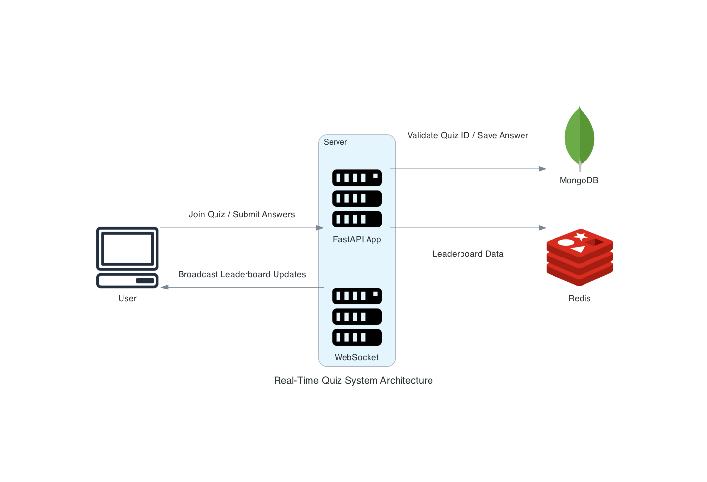

# Real-Time Quiz System

This repository contains a real-time quiz feature designed for an English learning application. It enables users to join quiz sessions, submit answers in real-time, and see their scores updated live on a leaderboard.

## Table of Contents
- [System Architecture](#system-architecture)
- [Technologies Used](#technologies-used)
- [Features](#features)
- [Setup Instructions](#setup-instructions)
- [Usage](#usage)
- [Challenge Requirements](#challenge-requirements)
- [Future Enhancements](#future-enhancements)
- [Contributing](#contributing)
- [License](#license)

## System Architecture


The architecture consists of the following components:
- **Client Applications**: Interfaces (web/mobile) for user interaction.
- **FastAPI Server**: Manages API endpoints and WebSocket connections.
- **MongoDB**: Stores user scores, quiz data, and handles queries.
- **Redis**: Handles real-time leaderboard data.

## Component Description
1. **Server (FastAPI App & WebSocket):** Handles client requests, manages WebSockets for real-time communication, and processes business logic.
2. **Client Applications:** User interfaces (web/mobile apps) for quiz participation.
3. **Database (MongoDB):** Stores user scores, quiz data, and handles queries.
4. **External Services (Redis):** Manages leaderboard data with fast read/write operations to keep the leaderboard updated in real-time.

## Data Flow
1. **User Joins Quiz:**
   - Client sends a request to the server.
   - Server validates the quiz ID against MongoDB.
   - If valid, acknowledges user’s participation.

2. **Submitting Answers:**
   - Client sends answers via WebSocket.
   - Server processes the answer, updates scores in MongoDB and Redis.

3. **Leaderboard Update:**
   - Server retrieves leaderboard data from Redis.
   - Server pushes leaderboard updates to all connected clients via WebSocket.

## Technologies and Tools
1. **FastAPI:** Modern, fast web framework for building APIs with Python.
   - **Justification:** Supports asynchronous programming and is easy to integrate with WebSockets.
   
2. **MongoDB:** NoSQL database that handles flexible and scalable data storage.
   - **Justification:** Schema-less nature and powerful querying capabilities.

3. **Redis:** In-memory data structure store for fast leaderboard updates.
   - **Justification:** Provides fast read/write operations, essential for real-time updates.

4. **WebSockets:** Enables real-time, two-way interactive communication.
   - **Justification:** Allows instant server-client data push.

5. **Docker:** Containerization for easy deployment and scaling.
   - **Justification:** Ensures consistent application behavior across different environments.

## Setup Instructions
1. **Clone the repository:**
    ```bash
    git clone https://github.com/TranPhucDang/resolve-coding-challenges.git
    cd repo-name
    ```

2. **Set up environment variables:**
   Create a `.env` file in the root directory and add your MongoDB and Redis credentials:
    ```
    MONGO_INITDB_ROOT_USERNAME=your_mongodb_username
    MONGO_INITDB_ROOT_PASSWORD=your_mongodb_password
    ```

3. **Build and run the Docker containers:**
    ```bash
    docker-compose up --build
    ```

4. **Start the server:**
    ```bash
    ./docker_run.sh
    ```

5. **Stop the server:**
    ```bash
    ./docker_stop.sh
    ```

6. **Access the application:**
   Open your browser and navigate to `http://localhost:8000`.

## Usage
- **Join a Quiz:**
  Send a POST request to `/join-quiz/` with the quiz ID.

- **Submit Answers:**
  Connect to the WebSocket endpoint `/ws/{quiz_id}` and send answers as JSON messages.

- **View Leaderboard:**
  Receive real-time leaderboard updates via WebSocket.

Here is the content of `client.html` for testing:

```html
<!DOCTYPE html>
<html>
<head>
    <title>Real-Time Quiz</title>
</head>
<body>
    <h1>Real-Time Quiz</h1>
    <button id="join">Join Quiz</button>
    <ul id="leaderboard"></ul>
    <script>
        let socket;
        const user_id = `user${Math.floor(Math.random() * 1000)}`;  // Unique user_id for each instance
        document.getElementById('join').onclick = async function() {
            const response = await fetch('http://localhost:8000/join-quiz/', {
                method: 'POST',
                headers: { 'Content-Type': 'application/json' },
                body: JSON.stringify({ quiz_id: '44444' })
            });
            const result = await response.json();
            console.log(result);
            socket = new WebSocket(`ws://localhost:8000/ws/quiz123?user_id=${user_id}`);
            socket.onmessage = function(event) {
                const data = JSON.parse(event.data);
                if (data.type === "leaderboard_update") {
                    const leaderboard = document.getElementById('leaderboard');
                    leaderboard.innerHTML = "";
                    data.data.forEach(user => {
                        const li = document.createElement('li');
                        li.textContent = `Rank ${user.rank}: ${user.user_id} - Score: ${user.score}`;
                        leaderboard.appendChild(li);
                    });
                }
            };
            // Simulate sending score updates
            setInterval(() => {
                socket.send(JSON.stringify({ type: 'score_update', user_id: user_id, score: Math.floor(Math.random() * 100) }));
            }, 5000);
        };
    </script>
</body>
</html>
```

## Challenge Requirements
### Part 1: System Design
1. **System Design Document:**
   - **Architecture Diagram:** Create an architecture diagram illustrating how different components of the system interact. This should include all components required for the feature, including the server, client applications, database, and any external services.
   - **Component Description:** Describe each component's role in the system.
   - **Data Flow:** Explain how data flows through the system from when a user joins a quiz to when the leaderboard is updated.
   - **Technologies and Tools:** List and justify the technologies and tools chosen for each component and why they were selected.

### Part 2: Implementation
2. **Pick a Component:** Real-Time Score Updates
   1. **Requirements for the Implemented Component:**
      - **Real-time Quiz Participation:** Endpoint to join a quiz using a unique quiz ID. Support multiple users joining simultaneously.
      - **Real-time Score Updates:** WebSocket connection to receive answer submissions and update scores.
      - **Real-time Leaderboard:** Push leaderboard updates to clients.
   
   2. **Scalability:**
      - Use Docker to containerize and scale the component.
      - Redis handles high-frequency leaderboard updates efficiently.
   
   3. **Performance:**
      - Optimize WebSocket handling and minimize database calls.
      - Use connection pooling for MongoDB to handle concurrent users.
   
   4. **Reliability:**
      - Implement error handling for WebSocket disconnections.
      - Use retry mechanisms for database operations.
   
   5. **Maintainability:**
      - Write clean, well-documented code.
      - Modularize the codebase for easier updates and debugging.
   
   6. **Monitoring and Observability:**
      - Use logging to monitor WebSocket events, score updates, and leaderboard changes.
      - Integrate tools like Prometheus and Grafana to visualize and monitor performance metrics.

## Future Enhancements
- **Enhanced Security**: Implement authentication and authorization.
- **Improved UI**: Develop a user-friendly front-end interface.
- **Analytics**: Add detailed analytics and reporting features.

## Contributing
Contributions are welcome! Please fork the repository and create a pull request with your changes.

## License
This project is licensed under the MIT License. See the [LICENSE](LICENSE) file for details.
